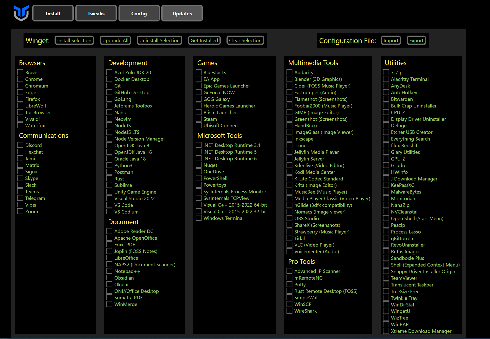

# FreshiestWindows
After a fresh install/reset of Windows. Here are the recommended applications and tweaks.
---
## Steps:
1. Change your display settings to your montior's best settings (Resolution/Refresh Rate)
2. Update all Drivers:
   1. Windows Update
   2. Video Drivers: [NVIDIA](https://www.nvidia.com/Download/) or [AMD](https://www.amd.com/en/support) 
   ---
3. Download Your Applications 
   
   *([Ninite](https://ninite.com/) Website to help download multiple popular applications)*
   1. [Chrome](https://www.google.com/chrome/): Web browser
   2. [EarTrumpet](https://eartrumpet.app/): A powerful volume control app for Windows
   3. [Discord](https://discord.com/): Talk, chat, hang out, and stay close with your friends and communities.
	---
1. Windows Debloater Softwares:
   1. [The Ultimate Windows Utility](https://christitus.com/windows-tool/): UI removes Windows pre-installed unnecessary applications, install software, and tweaks.  
     
      *Paste in Elevated (Run as Administrator) PowerShell prompt:*  
      >``` iwr -useb https://christitus.com/win | iex```  
      
   2. [Windows10Debloater](https://github.com/Sycnex/Windows10Debloater): UI removes Windows pre-installed unnecessary applications  

      *Paste in Elevated (Run as Administrator) PowerShell prompt:*  
      >``` iwr -useb https://git.io/debloat | iex```
      
   
	---
## Aesthetic Applications
1. [Posy's improved cursors for Windows 10](http://www.michieldb.nl/other/cursors/): changes Window's default Mouse pointers. *(More clean and modern)*
    
2. [Lively Wallpaper](https://www.rocksdanister.com/lively/): a free and open-source animated desktop wallpaper and screensaver software. *(Similar to Wallpaper Engine)*
   
3. [TranslucentTB](https://apps.microsoft.com/store/detail/translucenttb/9PF4KZ2VN4W9?hl=en-us&gl=us): A lightweight (uses a few MB of RAM and almost no CPU) utility that makes the Windows taskbar translucent/transparent on Windows 10 and Windows 11.

## Windows Search Changes  
1. [Search Deflector](https://github.com/spikespaz/search-deflector/releases): A free software that redirects Bing search in windows start menu to another search engine.

2. [Chrometana](https://chrome.google.com/webstore/detail/chrometana-redirect-bing/kaicbfmipfpfpjmlbpejaoaflfdnabnc): A Chrome Extensions that redirects all Bing and Cortana search to Google
3. Change Default Browser to Chrome
